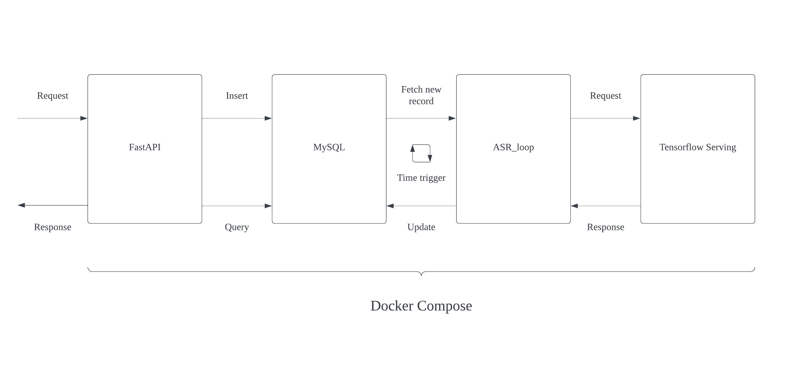

# ASR Server

[](https://www.docker.com/)
[](https://docs.docker.com/compose/)
[](https://www.python.org/)
[](https://www.tensorflow.org/)

This API server make use of FastAPI, MySQL, and tensorflow serving to provide a Restful API service to client. Client can send the request to server with a reachable address of audio file, and a ticket will be returned to client. After the server finish processing the audio file, client can get the result with that ticket.

The server consist of multiple components that run on Docker container. With Docker-Compose, a YAML file is used to configure the ASR server. Then, with a single command, you create and start all the services from the YAML file.

[Click here](https://github.com/manshing26/End-to-end-Mandarine-ASR) to check out the ASR training framework

## Architecture



## Dependenices

1. [Docker](https://www.docker.com/)
2. [Docker-Compose](https://docs.docker.com/compose/)

## Download the pre-trained model

1. Download the pre-trained model from [here]() and unzip the file
2. copy the model to saved_model/

    ```
    cp -r model_PINYIN/verR1.1c/PINYIN_verR1.1c_base saved_model/asr/1
    ```

## Run

```
# Start service:
docker-compose up

# Stop service:
docker-compose down
```

## API Document

After start the service on this pc (localhost), go:

- http://localhost:8081/docs for Swagger format docuemnt, or

- http://localhost:8081/redoc for ReDoc format document